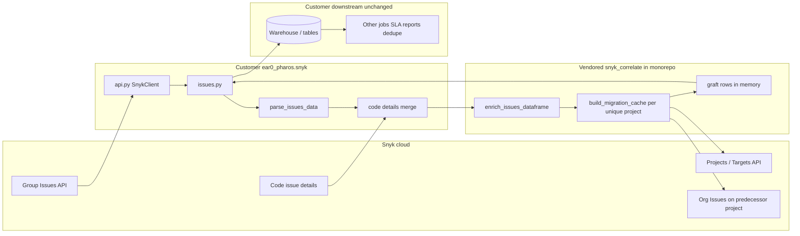
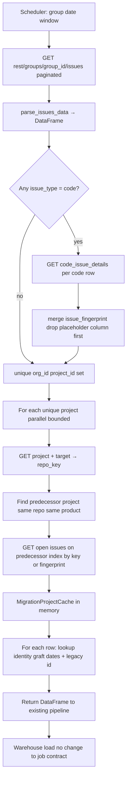
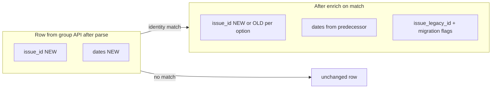

# Integrating `snyk_correlate` into supplied `issues.py` / `api.py`

Customer sample: `snyk-info-sharing/issues.py` and `api.py` (paths under `ear0_pharos.snyk` in their monorepo). This doc maps **their** code to the graft design in [IMPLEMENTATION_GUIDE.md](IMPLEMENTATION_GUIDE.md).

For internal QA before touching customer code: [INTERNAL_TESTING.md](INTERNAL_TESTING.md).

---

## How the application fits together

Migration graft is **one enrichment step** in the existing Pharos issue-ingestion path. It only adjusts columns on the issues DataFrame **before** that DataFrame is consumed downstream.

### System context




**Read path:** scheduled job calls `get_all_issue_*_between_dates` → `issues.py` pulls and parses → `enrich_issues_dataframe` (library) reads Projects/Targets and predecessor issues via the **same** `SnykClient` → enriched DataFrame returns to `issues.py` → existing load/transform jobs write to the warehouse. SLA and reporting keep reading the same column names; on matched migration rows, `issue_created_at` **/** `issue_updated_at` (and optionally `issue_id`) reflect predecessor history.

### One batch job — step-by-step




### Row model (same rows, enriched columns)




See [README.md](../README.md) for **Option A** (default: live `issue_id`) vs **Option B** (`graft_predecessor_issue_id=True`).

---

## How to bring the code in (recommended: vendored source)

**Default recommendation:** copy source into the customer monorepo. That avoids waiting on a new **pip / Artifactory / git dependency** approval. The integration hook in `issues.py` is identical.

**Full checklist and file list:** [VENDORING.md](VENDORING.md)

### Recommended — copy the library tree

1. From a tagged commit in `snyk-migration-graft`, copy the **`snyk_correlate/`** modules listed in [VENDORING.md](VENDORING.md) into their repo (e.g. `ear0_pharos/snyk/snyk_correlate/`).
2. In copied `snykapi.py`, **remove** the bundled `SnykClient` class and import **`from ear0_pharos.snyk.api import SnykClient`**.
3. Record the upstream **commit hash** in the customer PR.
4. Add imports and `enrich_issues_dataframe` in `issues.py` (sections below).

No new third-party deps if they already use `pandas` and `aiohttp`.

### Later — optional package install

If they later get approval for an external dependency:

```bash
pip install git+https://github.com/<org>/snyk-migration-graft.git@<tag>
```

Same imports (`from snyk_correlate.migration_graft import enrich_issues_dataframe`). Remove the vendored tree when switching.

### Do not — single-file paste

Copying only `migration_graft.py` fails at import time; the matching and cache modules are required.

| | **Vendored source (recommended)** | Package install (optional later) |
|--|-----------------------------------|----------------------------------|
| Approval | Internal source PR only | Package/registry process |
| Updates | Replace tree or merge diff from new tag | Bump pinned version |
| `issues.py` | Same `enrich_issues_dataframe` hook | Same |

---

## What they sent vs what production needs


| Area                | Customer `issues.py` today                                                                                   | Required for migration graft                                                          |
| ------------------- | ------------------------------------------------------------------------------------------------------------ | ------------------------------------------------------------------------------------- |
| Group pulls         | `get_all_issue_created_between_dates` / `get_all_issue_updated_between_dates` → `parse_issues_data` **only** | After parse: **code fingerprint merge (SAST)** → `enrich_issues_dataframe`            |
| `parse_issues_data` | Rich columns from coordinates[0]; **no** `issue_last_introduced_at`                                          | Add `issue_last_introduced_at` (min over `coordinates[].last_introduced_at`)          |
| `issue_column_list` | In `ear0_pharos.snyk.constants` (not in share)                                                               | Add graft columns + `issue_last_introduced_at`, `issue_fingerprint` if missing        |
| `api.py`            | `SnykClient` + full `links.next` pagination                                                                  | **Reuse as-is** for graft (`enrich_issues_dataframe` only needs `get_snyk_api_async`) |


Reference implementation in this repo: `snyk_correlate/pharos/issues.py` (`enrich_pulled_issues_dataframe` + group date-window entry points).

---


## Call order (group window jobs)

```text
GET group issues (paginated)     ← they already do this
  → parse_issues_data
  → get_all_code_issues_detail_by_issues (code rows only)
  → merge fingerprints (drop stale issue_fingerprint column before merge)
  → enrich_issues_dataframe      ← snyk_correlate (graft on by default)
  → return df to existing warehouse path
```

**Important:** Use **one** `async with SnykClient(...) as client:` for the whole sequence so the migration cache build reuses the same session/semaphore. Today each helper opens its own client; refactor the two group functions (or a shared internal helper) so graft runs **inside** that context.

---


## 1. Imports (after vendored tree is in place)

Path depends on where the tree lives; example:

```python
from ear0_pharos.snyk.snyk_correlate.coordinates import aggregate_last_introduced_at
from ear0_pharos.snyk.snyk_correlate.migration_graft import enrich_issues_dataframe
```

See [VENDORING.md](VENDORING.md) for the file list and `SnykClient` wiring.

---


## 2. `parse_issues_data` — add `issue_last_introduced_at`

Inside the issue loop, after `coordinates = attributes.get("coordinates", [])`:

```python
dt = aggregate_last_introduced_at(coordinates, use_min=True)
temp_issue["issue_last_introduced_at"] = dt.isoformat() if dt else None
```

Extend `issue_column_list` in their constants with at least:

- `issue_last_introduced_at`
- `issue_fingerprint` (filled after code merge)
- `issue_legacy_id`, `issue_migration_grafted`, `issue_migration_identity`
- `issue_migration_old_org_id`, `issue_migration_old_project_id`
- `issue_snyk_id_current` (only populated when using option B)

(`enrich_issues_dataframe` adds/overwrites graft fields; columns should exist before warehouse write.)

---


## 3. Code fingerprint merge (SAST)

Before graft, merge code details the same way as their pipeline already does for other jobs. Critical detail from pilot:

```python
left = df_issues.drop(columns=["issue_fingerprint"], errors="ignore")
df_issues = left.merge(df_code, how="left", on=["issue_key", "project_id"])
```

Filter **code rows only** when fetching details (their `get_all_code_issues_detail_by_issues` currently iterates **all** rows — wasteful and may error on non-code issues):

```python
code_rows = issues[issues["issue_type"] == "code"]
```

Confirm `issue_type` value for SAST in their tenant (usually `"code"`).

---


## 4. Refactor group entry points (sketch)

Replace the body of `get_all_issue_created_between_dates` / `get_all_issue_updated_between_dates` after param setup with:

```python
async with SnykClient(...) as client:
    pages = await client.get_snyk_api_async(
        f"rest/groups/{group_id}/issues",
        param,
        retry=api_call_retry,
    )
    df = parse_issues_data([pages])

    code_rows = df[df["issue_type"] == "code"]
    if not code_rows.empty:
        tasks = [
            client.get_snyk_api_async(
                f"rest/orgs/{row['org_id']}/code_issue_details/{row['issue_key']}",
                {"version": code_issues_api_version, "project_id": row["project_id"]},
                retry=api_call_retry,
            )
            for _, row in code_rows.iterrows()
        ]
        df_code = parse_code_issue_details(await asyncio.gather(*tasks))
        left = df.drop(columns=["issue_fingerprint"], errors="ignore")
        df = left.merge(df_code, how="left", on=["issue_key", "project_id"])

    if apply_migration_graft:  # default True; env/flag for rollout
        df = await enrich_issues_dataframe(
            df,
            client,
            api_version=projects_api_version,
            issues_api_version=api_version,
            graft_predecessor_issue_id=False,  # True → predecessor id in issue_id; live in issue_snyk_id_current
        )
    return df
```

Add parameters to their public functions as needed:

- `apply_migration_graft: bool = True`
- `projects_api_version: str` (Projects/Targets API version they already use elsewhere)
- `code_issues_api_version: str` (same as today’s code detail calls)
- `graft_predecessor_issue_id: bool = False` (option B)

Param names `start_date` **/** `end_date` map to API `created_after` **/** `created_before` (or updated_*) — they already do this correctly.

---


## 5. `api.py`

No change required for graft. Optional improvements from this repo’s `snykapi.py`:

- 429 → sleep and retry same request
- `max_pages` for dev-only caps

Keep proxy/ssl behavior they rely on.

---


## 6. Row semantics (warehouse)

One row per issue from the API; graft **updates columns in place** on match (does not append a second row).


|                       | Option A (default)              | Option B                          |
| --------------------- | ------------------------------- | --------------------------------- |
| **Match:** `issue_id` | Live (new)                      | Predecessor                       |
| **Match: dates**      | From predecessor                | From predecessor                  |
| **Match: extra**      | `issue_legacy_id` = predecessor | `issue_snyk_id_current` = live id |


**No match:** all columns from the current pull unchanged (except optional empty migration metadata).

Details: [README.md](../README.md).

---


## 7. Validation

1. Internal: [INTERNAL_TESTING.md](INTERNAL_TESTING.md) on pilot org.
2. Customer staging: one group date window; compare graft counts and spot-check migrated repo.
3. Reference metrics: org `57da1293-…` full export in this repo (`output/issues.csv`).

---


## Files **not** in the share

Integration also needs edits to `ear0_pharos.snyk.constants` (`issue_column_list`) and whatever orchestrator calls these functions (to pass `projects_api_version` and flags). Ask customer for `constants.py` and one caller of `get_all_issue_updated_between_dates` if you need a full PR-shaped diff.