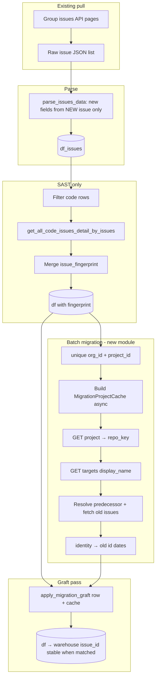

# Implementation guide: Pharos SNYK issues + migration graft (SCA & SAST)

**Status:** Draft v4 — implements batch graft in this repo (`snyk_correlate/migration_graft.py`, `snyk_correlate/pharos/issues.py`). **Product decisions (v4):** dual-column `issue_id` + graft **`created_at`**, **`updated_at`**, and **`last_introduced_at`** from predecessor; migration enrich **on by default** (opt out via `SNYK_APPLY_MIGRATION_GRAFT=0` or `apply_migration_graft=False`).

## Changelog — v3 → v4 (product + implementation)

1. **§8.2 decided:** graft **`issue_updated_at`** from the predecessor issue together with **`issue_created_at`** and **`issue_last_introduced_at`** (same as SLA requirement for created/updated on output rows).
2. **Default behavior:** `pull_issues_for_pipeline(..., apply_migration_graft=True)` and dev script default `SNYK_APPLY_MIGRATION_GRAFT=1`; disable with `0` / `false` / `no` / `off`.
3. **Implementation:** coordinates `last_introduced_at` extraction fixed in `snyk_correlate_py/snykapi.py` and `pharos/issues.py` (nested `attributes.coordinates[]`, min aggregation default).

## Changelog — Claude review (v2 → v3)

1. **Bug found:** `last_introduced_at` is nested under `attributes.coordinates[].last_introduced_at` in the real Issues API response, not a top-level `attributes.last_introduced_at`. §2.2, §4, §6 (Phase A), §7, and `snyk_correlate_py` all assumed top-level — `snyk_correlate_py/snykapi.py` currently has this bug live and returns nothing for this field. Needs a fix there before it's reused as planned in §3/§15. See §2.2 and §6 Phase A for corrected detail, and the new open question in §14 about min vs. max aggregation across coordinates.
2. **§8.1 recommendation added:** lean toward dual-column (`issue_id` stays live/new, `issue_legacy_id` holds the old id as metadata) instead of full graft, given `match-snyk-projects`' own `apply --action delete` can permanently remove the predecessor project — a grafted old `issue_id` would then reference a Snyk resource that no longer exists at all, not just a stale one.
3. **§8.2 (v3, superseded by v4):** originally recommended not grafting `updated_at` — **v4 grafts it** per product requirement (see §8.2).
4. **§3 step 1 revised:** prefer target-based matching (`attributes.url` / `attributes.display_name` via the project→target relationship) as primary, consistent with `issuewrapper` and `snyk_correlate_py`, which are already built and tested against it. Parsing `attributes.name` is demoted to a fallback/validation signal, not primary — project name strings aren't guaranteed to be clean `owner/repo`.
5. **Pseudocode fix in §6, Phase D:** `OldIssueSnapshot`/cache index needed `old_project_id` / `old_org_id` somewhere addressable — the original pseudocode read `idx.old_project_id` off a plain `dict[str, OldIssueSnapshot]`, which doesn't have that attribute. Fixed by wrapping the index (see §6).
6. **New §7.1 addition:** durable cross-run caching noted as a phase-2 optimization (not a blocker) — predecessor resolution doesn't change once established, so recomputing Projects→Targets for the same stable `(org_id, project_id)` on every windowed pull is avoidable work.
7. **§14 checklist updated** with recommendations where I have one, and two new items (coordinates min/max, repo_key source of truth).

**Artifacts reviewed:**

| Source | Role |
|--------|------|
| `snyk-info-sharing/issues.py` | Group/org issue fetch, `parse_issues_data`, code issue details |
| `snyk-info-sharing/api.py` | Async paginated Snyk REST client |
| `issuewrapper` (Go) | Repo-scoped correlate CLI + matching rules |
| `snyk_correlate_py` | Python port of correlate/resolver (Protocols + `snykapi.py`) — **preferred library for predecessor logic in Pharos** |

---

## 1. Goal (product)

After repo migration, group issues return **new** `issue_id` and **new** timestamps. Downstream dedupes on **`issue_id`** and SLA uses **`issue_created_at` / `issue_updated_at`**.

**Target behavior (Option D2 — graft):** For findings that exist on both old and new projects (same repo, same product line):

| Field on output row | Source when matched | v4 status |
|---------------------|-------------------|-----------|
| `issue_id` | **New** (unchanged, kept live) | Dual-column — see §8.1 |
| `issue_legacy_id` | **Old** issue `id` (new column) | Implemented |
| `issue_created_at` | **Old** `created_at` | Grafted when matched |
| `issue_updated_at` | **Old** `updated_at` | Grafted when matched (v4) |
| `issue_last_introduced_at` | **Old** (aggregated `coordinates[].last_introduced_at`; min default — §6/§14) | Grafted when matched |
| All other parsed fields | **New** group issue (title, severity, status, coordinates fixability, etc.) | Unchanged |

**When matched**, SLA-facing timestamps on the warehouse row reflect **predecessor** history while **`issue_id`** stays the live API id. **`issue_id` full graft** remains optional/future (§8.1).

When **not** matched: keep all fields from the new issue (current behavior).

**Enrichment default:** migration graft runs unless explicitly disabled (`apply_migration_graft=False` or `SNYK_APPLY_MIGRATION_GRAFT=0`).

**Applies to both SCA and SAST** using different stable join keys (see §4).

---

## 2. How their pipeline works today

### 2.1 Ingestion entry points

| Function | API |
|----------|-----|
| `get_all_issue_created_between_dates` | `GET rest/groups/{group_id}/issues?created_after&created_before` |
| `get_all_issue_updated_between_dates` | `GET rest/groups/{group_id}/issues?updated_after&updated_before` |
| `get_all_issues_by_organization` | `GET rest/orgs/{org}/issues` (per org) |

Pagination: `links.next` in `SnykClient.get_snyk_api_async`.

### 2.2 Parsed row (today)

- **Primary key:** `issue_id` ← `data[].id`
- **Locators:** `org_id`, `project_id`
- **SCA join key:** `issue_key` ← `attributes.key`
- **Types:** `issue_type` ← `attributes.type` (`package_vulnerability` vs `code` — confirm in prod samples)
- **Dates:** `issue_created_at`, `issue_updated_at` only — **no** `last_introduced_at`
- **Correction (v3):** `last_introduced_at` is **not** a top-level attribute — it's nested at `attributes.coordinates[].last_introduced_at` (confirmed against Snyk's own Issues API example payload). A project/issue can have multiple `coordinates` entries (multiple manifests/paths), each with its own `last_introduced_at`. Extraction must iterate `coordinates[]` and aggregate — see Phase A (§6) and the open question in §14 on min vs. max.

### 2.3 SAST fingerprint (existing step)

`get_all_code_issues_detail_by_issues` →  
`GET rest/orgs/{org_id}/code_issue_details/{issue_key}?project_id=…`  
→ `issue_fingerprint` merged on `(org_id, issue_key, project_id)`.

**SAST migration identity = `issue_fingerprint`.**  
**SCA migration identity = `issue_key`.**

---

## 3. Repo resolution (your proposed discovery path)

For each **distinct** `(org_id, project_id)` seen in the pull (not each issue):

1. **`GET rest/orgs/{org_id}/projects/{project_id}?expand=target`**  
   [Projects API](https://docs.snyk.io/developer-tools/snyk-api/reference/projects) — derive **`repo_key`** (`owner/repo`):
   - **Primary (v3 revision):** use the project→target relationship's `attributes.url` (SCM) or `attributes.display_name` (CLI), normalized the same way `issuewrapper` / `snyk_correlate_py.matching` already do (strip scheme/host/`.git`, strip manifest suffix after `(`). This is what `match-snyk-projects` and `snyk_correlate_py` already match on successfully — reuse it rather than introducing a second, less-reliable path.
   - **Fallback only:** parsing `attributes.name` (often `owner/repo` or `owner/repo:manifest…`) — project name strings aren't guaranteed to be clean `owner/repo` (monorepos, custom naming), so treat this as a sanity check / fallback when target data is unavailable, not the primary signal.
   - Confirm against real SCM and CLI project responses which field is actually reliable before committing either way (open question, §14).

2. **`GET rest/orgs/{org_id}/targets?display_name={repo_key}`**  
   [Targets API](https://docs.snyk.io/developer-tools/snyk-api/reference/targets) — same as Go CLI / Postman.

3. **List projects per matching target** → find **new** project (row’s `project_id`) and **predecessor** project(s):
   - Same **product** (SCA vs SAST): project type / issue type on the row.
   - Same **SCA manifest line** when product is SCA (`ProjectMatchKey` on project name + repo_key).
   - Predecessor = oldest same-repo + same-product (+ same line) candidate with `created_at` before the new project.

4. **`GET` open issues on predecessor project** (SCA: `type=package_vulnerability`; SAST: `type=code` + fingerprint enrichment).

5. Build **`identity → old_issue_record`** index for that `(org_id, project_id)` cache entry.

Reuse **`snyk_correlate_py`** (`LiveResolver`, `Correlator`, `snykapi.py`) instead of subprocess Go where possible — same rules, async-friendly, already unit-tested.

---

## 4. SCA vs SAST — single design, two join keys

| Product | Detect | Migration identity | Old issues fetch | Extra before graft |
|---------|--------|-------------------|------------------|-------------------|
| **SCA** | `issue_type == package_vulnerability` (confirm) | `attributes.key` → `issue_key` | Org issues, SCA type | None |
| **SAST** | `issue_type == code` (confirm) | `issue_fingerprint` | Org issues, SAST type + code detail for fingerprint | **Code details merge first** |

**Important:** Graft for SAST **cannot** run inside the raw `parse_issues_data` inner loop **before** code details exist. Pipeline order is fixed (§6).

**Both products in one job:** Cache key should include product, e.g. `(org_id, project_id)` implicitly encodes one product per Snyk project — one cache entry per project id is enough.

**Dual-product repo:** Two different `project_id`s (SCA npm + SAST code) → two cache entries, each with its own predecessor + index. No cross-mixing.

---

## 5. Issue-by-issue vs batch enrichment — **use batch**

### 5.1 Do **not** do per-issue API calls

If every group issue row triggers Project + Targets + old-issues fetch:

- Group pull ≈ **10⁴–10⁶** rows → API storm, rate limits, runtime unusable.

### 5.2 Recommended: **prefetch cache, then O(1) lookup per row**

```text
unique_projects = unique (org_id, project_id) from batch
for each unique project (parallel, bounded concurrency):
    load MigrationProjectCache entry  # steps §3.1–3.5 once

for each issue record (parse loop or dataframe apply):
    graft from cache[org_id, project_id][migration_identity]  # memory only
```

| Approach | API calls (order of magnitude) | Per-row cost |
|----------|--------------------------------|--------------|
| Per-issue correlate | O(issues) × (project + targets + issues) | Unacceptable |
| **Batch prefetch** | O(unique projects) × (project + targets + old issues) | O(1) lookup |

**Unique projects** in a group window is usually **≪ issue count** (many issues per project).

### 5.3 Where the loop runs

Two equivalent options:

| Option | Description |
|--------|-------------|
| **B1 — Two-pass on API pages** | Pass 1: walk JSON, collect unique `(org_id, project_id)` + append raw issue dicts. Warm cache. Pass 2: build `temp_issue` + graft. |
| **B2 — Parse then enrich DataFrame** | Keep `parse_issues_data` → DataFrame; `enrich_migration_graft(df, client)` adds/overwrites columns (vectorized `apply` with cache). |

**Recommendation:** **B2** for minimal churn to existing callers; **B1** if you want graft before any `temp_issue.update` (same logic, clearer separation).

**Not** “correlate inside `for issue in record.get('data')`” except the **lookup** step.

---

## 6. End-to-end pipeline (SCA + SAST)



### Phase A — Parse (inside `parse_issues_data`)

Add from **new** issue only (always):

- `issue_last_introduced_at` = aggregate of `attributes.coordinates[].last_introduced_at` (confirmed nested field, not top-level — see §2.2). **Aggregation direction is an open decision, not yet "max" by default:**
  - **max** across coordinates = most-recently-introduced path. Can understate how long an issue has actually existed if it first appeared via an older manifest/coordinate and a newer coordinate picked it up later.
  - **min** across coordinates = earliest known introduction across any path. Recommended default for a grace-period clock, since the SLA should start from the first point it could have been found/fixed — but confirm with whoever owns the SLA definition (§14).
  - Whichever direction is chosen, apply it **symmetrically** to both this (new-issue) extraction and the `OldIssueSnapshot` fields built in Phase C, or the graft compares two differently-aggregated values.
- Optional audit columns (new issue ids): `issue_snyk_id_current`, `issue_created_at_current` — **if** product wants to retain live Snyk id after graft (see §8).

Do **not** call Projects/Targets here.

### Phase B — SAST fingerprint (existing)

Unchanged; must complete **before** graft for code rows.

### Phase C — Batch cache (`MigrationProjectCache`)

New async module (see §7). Input: list/set of `(org_id, project_id)`. Output: dict keyed by `(org_id, project_id)` → `ProjectMigrationIndex`:

```python
@dataclass
class OldIssueSnapshot:
    issue_id: str
    created_at: str
    updated_at: str
    last_introduced_at: str | None  # aggregated from attributes.coordinates[] - same
                                     # min/max direction as Phase A, applied symmetrically

@dataclass
class ProjectMigrationIndex:
    old_org_id: str
    old_project_id: str
    by_identity: dict[str, OldIssueSnapshot]  # key or fingerprint -> snapshot

# (org_id, project_id) -> ProjectMigrationIndex
MigrationProjectCache = dict[tuple[str, str], ProjectMigrationIndex]
```

**Correction (v3):** the original pseudocode referenced `idx.old_project_id` where `idx` was typed as a plain `dict[str, OldIssueSnapshot]` — a dict has no such attribute. `old_org_id`/`old_project_id` now live on the wrapping `ProjectMigrationIndex`, with the identity→snapshot map nested inside it as `by_identity` (see Phase D below for the corrected access pattern).

Populate `OldIssueSnapshot` from predecessor open issues (same fields group API would expose), extracting `last_introduced_at` from `attributes.coordinates[]` per §2.2/§6.

### Phase D — Graft (Option D2)

```python
def migration_identity(row) -> str | None:
    if is_sast(row["issue_type"]):
        return row.get("issue_fingerprint") or None
    return row.get("issue_key") or None

def apply_migration_graft(row, cache: MigrationProjectCache) -> dict:
    idx = cache.get((row["org_id"], row["project_id"]))
    ident = migration_identity(row)
    if not idx or not ident or ident not in idx.by_identity:
        return {}  # no overrides
    old = idx.by_identity[ident]
    return {
        # v3: dual-column by default, not a full issue_id graft - see §8.1.
        # Revert to overriding "issue_id" directly only if product explicitly
        # signs off on full graft after confirming nothing calls Snyk REST
        # with the stored id.
        "issue_legacy_id": old.issue_id,
        "issue_created_at": old.created_at,
        "issue_updated_at": old.updated_at,
        "issue_last_introduced_at": old.last_introduced_at,
        "issue_migration_grafted": True,
        "issue_migration_old_org_id": idx.old_org_id,
        "issue_migration_old_project_id": idx.old_project_id,
    }
```

Merge overrides into row **before** or **after** `temp_issue.update` blocks — equivalent if all columns set at end.

---

## 7. Module placement (Pharos)

| Choice | Recommendation |
|--------|------------------|
| **`issues.py` only** | Avoid — file already large; mixes parse + migration + async orchestration. |
| **New package module** | **Yes** — e.g. `ear0_pharos/snyk/migration_enrichment.py` (or `migration_graft.py`). |
| **Dependency** | Vendor or package-depend on **`snyk_correlate`** for resolver + issue fetch; **vendor copy is the recommended customer delivery** ([VENDORING.md](VENDORING.md)) — thin Pharos wrapper for cache + graft + dataframe. |
| **`issues.py` changes** | Small: Phase A columns; **`await enrich_issues_dataframe(df, client)`** at end of `get_all_issue_*` before return (graft **on by default**; pass `apply_migration_graft=False` for raw pull). |

**Public API sketch:**

```python
# migration_enrichment.py
async def build_migration_cache(
    client: SnykClient,
    project_keys: Iterable[tuple[str, str]],  # org_id, project_id
    api_version: str,
) -> MigrationProjectCache: ...

def enrich_dataframe_migration_graft(
    df: pd.DataFrame,
    cache: MigrationProjectCache,
) -> pd.DataFrame: ...
```

Wire into ( **`apply_migration_graft=True` by default** ):

- `get_all_issue_created_between_dates`
- `get_all_issue_updated_between_dates`
- (Optional) `get_all_issues_by_organization`

**Dev / local:** `scripts/run_pharos_issues.py` — `SNYK_APPLY_MIGRATION_GRAFT` defaults to **`1`**. Set to **`0`**, **`false`**, **`no`**, or **`off`** to skip graft. Row sample size: **`SNYK_ISSUES_LIMIT`** (not the graft flag).

### 7.1 Durable cache (phase 2, not a blocker)

`MigrationProjectCache` as designed is per-run/in-memory only - built fresh
on every windowed pull. Since a project's predecessor doesn't change once
established, re-running Projects→Targets resolution for the same stable
`(org_id, project_id)` on every recurring pull is avoidable work once the
project set stabilizes. A small durable store (`project_id -> old_project_id`,
resolved once, refreshed only when a project is first seen or on a
long TTL) would cut this to near-zero repeat cost. Not needed for a first
pilot, worth planning for once this runs on a real schedule.

---

## 8. Decisions for product / Claude review

### 8.1 Grafting `issue_id`

| Keep graft (D2) | Dual columns |
|-----------------|--------------|
| Downstream unchanged primary key | Safer for any tool calling Snyk with `issue_id` |
| Stored id may not exist on **new** project | `issue_id` = current API; `issue_legacy_id` = old |

**Review question:** Can anything in Pharos call Snyk REST with stored `issue_id` expecting the **new** project?

**Recommendation (v3):** default to dual columns, not full graft. Reason beyond "can anything call it today": `match-snyk-projects`' own `apply --action delete` deletes the source/duplicate project once a migration is confirmed. If that cleanup runs, a grafted old `issue_id` doesn't just go stale - it becomes a permanent 404, a reference to a Snyk resource that no longer exists at all. That risk exists independent of today's answer to the review question above, since cleanup could happen at any point after this pipeline runs. Dual-column costs one extra column and keeps the door open to full graft later if product still wants it after weighing this.

### 8.2 Grafting `issue_updated_at`

Old `updated_at` on the predecessor reflects historical scan/update activity on the **old** project; the new project’s live `updated_at` resets the clock after migration.

| Option | Behavior |
|--------|----------|
| **A (v3 review)** | Graft `created_at` + `last_introduced_at` only; keep **new** `updated_at`. |
| **B (v4 — adopted)** | Graft **`created_at`**, **`updated_at`**, and **`last_introduced_at`** from predecessor when identity matches. |

**Decision (v4):** **Option B** — downstream SLA and dedupe logic expect **`issue_created_at` / `issue_updated_at`** to reflect continuity across migration; graft all three date fields from the old open issue snapshot.

**Operational note:** If any job uses **`updated_after`** on the **warehouse** row as an incremental watermark, grafted `issue_updated_at` reflects predecessor history (may be older than the latest scan on the new project). Date-window **API pulls** still use Snyk query params on the live API; graft affects **stored** columns only. Document this for owners of incremental sync jobs.

### 8.3 `repo_key` source of truth

**v3 revision:** target relationship (`attributes.url`/`display_name`) is now primary, `attributes.name` is fallback only — see §3 step 1.

**Review question:** Confirm sample payloads for SCM vs CLI projects (both the project→target relationship and `attributes.name`) to settle which is reliable in this org's real data; document parser in `matching.py` parity.

### 8.4 No predecessor

Leave row unchanged; `issue_migration_grafted = false`.

---

## 9. Alternative D1 (not preferred if D2 approved)

Sidecar columns only (`issue_effective_last_introduced_at`, keep new `issue_id`). Documented in v1; use if graft rejected.

---

## 10. What we should NOT do

- Per-issue Projects/Targets/issues API in `parse_issues_data` inner loop.
- Match predecessor at **group** level without org + repo + product scope.
- SAST graft before fingerprint merge.
- Assume one correlate run covers all orgs in a group pull without per-`org_id` cache.
- Change `api.py` pagination/auth unless required for new endpoints.

---

## 11. Testing plan

| # | Test |
|---|------|
| 1 | Unit: `repo_key` from target relationship (SCM, CLI, hostname change, manifest suffix) — primary path per §3; `attributes.name` fallback covered separately |
| 2 | Unit: `migration_identity` SCA vs SAST rows |
| 3 | Unit: `coordinates[].last_introduced_at` aggregation (min/max, whichever is chosen) — multiple coordinates, missing coordinates |
| 4 | Unit: graft apply with fake cache — sets `issue_legacy_id`, **`issue_created_at`**, **`issue_updated_at`**, **`issue_last_introduced_at`**; leaves live **`issue_id`** unchanged; no-op when miss |
| 5 | Integration: one migrated repo, SCA row — `issue_legacy_id` matches old open issue's `id`, `issue_id` still matches the new one |
| 6 | Integration: same repo, SAST row — after code details, graft by fingerprint |
| 7 | Integration: non-migrated project — no graft, counts unchanged |
| 8 | Perf: assert single project fetch per unique `(org_id, project_id)` (mock call counts) |

---

## 12. Implementation order

1. **Review this doc** (Claude / product) — resolve §8.
2. Phase A: `issue_last_introduced_at` in parse + column list.
3. Add `migration_enrichment.py` + tests with mocked Snyk.
4. Integrate `snyk_correlate_py` resolver/issues client into cache builder.
5. Phase B unchanged (code details).
6. Wire `enrich_dataframe_migration_graft` into group issue entry points.
7. Pilot one migrated repo (SCA + SAST projects).
8. SLA owner confirms which date fields drive grace period.

---

## 13. Optional issuewrapper (Go) role

- **Regression reference** / CLI manual checks (`snyk-correlate --display-name …`).
- **Not required** in Pharos runtime if `snyk_correlate_py` is embedded.

Go join helper (`issuewrapper/join.go`) remains reference for D1-style date-only merge.

---

## 14. Open questions (checklist for reviewers)

- [ ] Exact `issue_type` strings for SCA vs SAST in group payloads? *(no recommendation - needs a prod sample)*
- [ ] D2 graft approved for `issue_id` + which date fields (§8.1, §8.2)? *(v4: dual-column `issue_id`; graft **`created_at`**, **`updated_at`**, **`last_introduced_at`** — decided)*
- [ ] Migration graft enabled by default in production entry points? *(v4: **yes** in `snyk_correlate_py`; Pharos wire-up should match — opt out explicit)*
- [ ] Retain `issue_snyk_id_current` column after graft? *(v3 recommendation: yes regardless of the `issue_id` decision - cheap insurance)*
- [ ] `enrich_*` called inside all three `get_all_issue_*` functions or single orchestrator? *(v3 recommendation: explicit call from each entry point rather than a hidden side effect, so a broken cache build can't silently corrupt the base issue pull, and callers who want the raw pull without graft still can get it)*
- [ ] Concurrency limit for cache build (reuse `concurrent_api_calls`)? *(v3 recommendation: yes, reuse as-is)*
- [ ] Warehouse DDL / backfill for new columns? *(no recommendation - needs a data/warehouse owner, separate workstream)*
- [ ] **New (v3):** aggregation direction for `attributes.coordinates[].last_introduced_at` - min (earliest introduction, recommended default) or max (most recent path)? Needs SLA owner sign-off (§6 Phase A).
- [ ] **New (v3):** is the project→target relationship (`attributes.url`/`display_name`) or the project's own `attributes.name` the more reliable source for `repo_key` in this org's real data? (§3 step 1) Needs a prod sample of both an SCM and a CLI project response.
- [ ] **New (v3):** fix `snyk_correlate_py/snykapi.py`'s `last_introduced_at` parsing (was top-level; now `coordinates[]`) — **done in port**; confirm in Pharos merge.

---

## 15. Summary (v4)

**Preferred design:** Batch-build `MigrationProjectCache` keyed by `(org_id, project_id)` using target-relationship matching → predecessor issues (**SCA + SAST**), then **graft** predecessor **`issue_created_at`**, **`issue_updated_at`**, and **`issue_last_introduced_at`**, plus **`issue_legacy_id`**, while keeping live **`issue_id`** — **not** issue-by-issue API. **Migration enrich runs by default** unless disabled.

**Before Pharos production merge:**
1. ~~Fix `last_introduced_at` parsing~~ — done in `snyk_correlate_py`; verify in Pharos after copy.
2. Settle min vs. max aggregation across `coordinates[]` with the SLA owner if not already confirmed (implementation uses **min**).
3. Confirm target-relationship vs. `attributes.name` as the reliable `repo_key` source against real SCM/CLI project responses (§3, §14).
4. §8.1: dual-column **`issue_id`** (decided). §8.2: graft **`updated_at`** (decided v4).

New logic in **`migration_graft.py`** (Pharos: `migration_enrichment.py`), minimal edits to **`issues.py`**. SAST requires code-details merge **before** graft. Reuse **`snyk_correlate_py`** for matching/fetch parity with Go `issuewrapper`.
